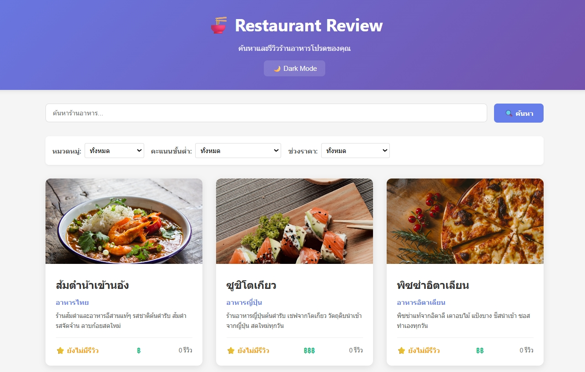
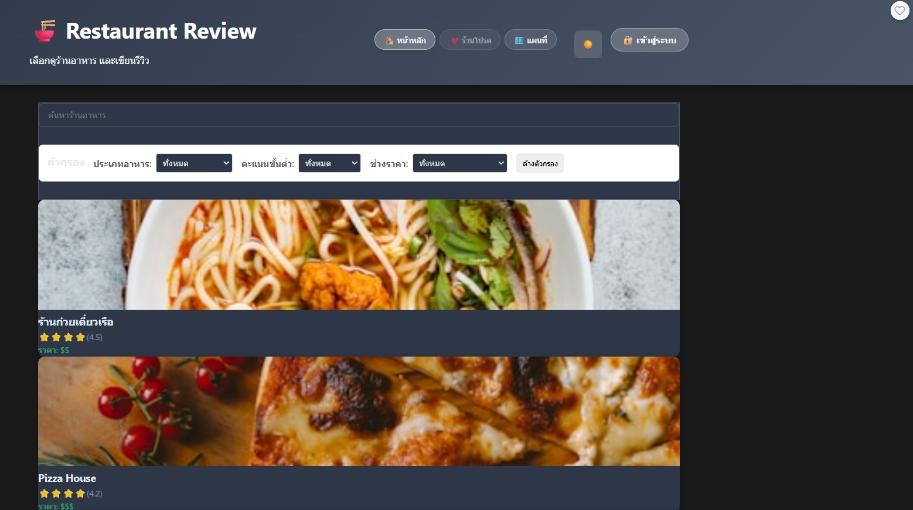

# �️ Restaurant Review App

A modern, responsive restaurant review application built with React and Express.js.

## 🎯 Live Demo & Quick Start

### ⭐ Option 1: HTML Version (Works Immediately)
Open `WORKING-APP.html` in your browser - **No setup required!**

### ⚛️ Option 2: React Development Version  
Run the React app in `frontend/` directory

## ✨ Features Completed

- 🍽️ **Restaurant Listing** - Browse 6 featured restaurants with photos
- 🔍 **Smart Search** - Search by name, cuisine, or description  
- 📊 **Advanced Filtering** - Filter by cuisine type and price range
- 🌙 **Dark/Light Mode** - Toggle themes with localStorage persistence
- 🖼️ **Beautiful Images** - High-quality photos from Unsplash
- 📱 **Responsive Design** - Works on desktop, tablet, and mobile
- ⭐ **Review System** - View and write restaurant reviews
- 🎨 **Modern UI** - Gradient backgrounds and smooth animations

## รายละเอียดโปรเจค
เว็บไซต์รีวิวร้านอาหารแบบ Fullstack ที่พัฒนาด้วย React และ Express ผู้ใช้สามารถค้นหาร้านอาหาร กรองตามหมวดหมู่ ดูรายละเอียด และเขียนรีวิวได้

## เทคโนโลยีที่ใช้
- **Frontend**: React 18 + Vite
- **Backend**: Node.js + Express  
- **Data**: JSON File Storage + Static API
- **Styling**: CSS3 with CSS Variables, Flexbox & Grid
- **Images**: Unsplash API integration

## Features ที่ทำได้

### Required Features (70 คะแนน)
- [x] แสดงรายการร้านอาหารทั้งหมด
- [x] ค้นหาร้านอาหารตามชื่อและคำอธิบาย (พร้อม Debounce)
- [x] กรองตามหมวดหมู่ (อาหารไทย, ญี่ปุ่น, อิตาเลียน, จีน, ฟาสต์ฟู้ด)
- [x] กรองตามคะแนนขั้นต่ำ (2-4 ดาว)
- [x] กรองตามช่วงราคา (฿, ฿฿, ฿฿฿)
- [x] ดูรายละเอียดร้านพร้อมรีวิวทั้งหมด
- [x] เพิ่มรีวิวใหม่พร้อม Validation
- [x] อัพเดท Rating และจำนวนรีวิวอัตโนมัติ
- [x] แสดง Loading และ Error States

### Bonus Features 
- [x] Responsive Design (ใช้งานบนมือถือได้)
- [x] Hover Effects และ Transitions
- [x] Multiple Filters (กรองหลายเงื่อนไขพร้อมกัน)

## วิธีติดตั้งและรัน

### Prerequisites
- Node.js (v16 หรือใหม่กว่า)
- npm หรือ yarn

### Backend
```bash
cd backend
npm install
cp .env.example .env
npm run dev
```
Backend จะรันที่ http://localhost:3000

### Frontend
```bash
cd frontend
npm install
cp .env.example .env
# เพิ่ม Google Maps API Key ในไฟล์ .env (ถ้าต้องการใช้ฟีเจอร์แผนที่)
```
Frontend จะรันที่ http://localhost:5173

### 🗺️ Google Maps Setup (Optional)

แอปสามารถใช้งานได้โดยไม่ต้องมี Google Maps API Key แต่หากต้องการใช้ฟีเจอร์แผนที่:

1. ไปที่ [Google Cloud Console](https://console.cloud.google.com/)
2. สร้างโปรเจกต์ใหม่หรือเลือกโปรเจกต์ที่มีอยู่
3. เปิดใช้งาน APIs:
   - Maps JavaScript API
   - Places API (ถ้าต้องการฟีเจอร์ค้นหา)
4. สร้าง API Key ในหน้า Credentials
5. คัดลอก API Key ไปใส่ในไฟล์ `.env`:
   ```
   REACT_APP_GOOGLE_MAPS_API_KEY=your_api_key_here
   ```

**หมายเหตุ:** หากไม่มี API Key แผนที่จะแสดงในโหมด fallback ที่แสดงรายชื่อร้านอาหารแทน

## API Endpoints

### Restaurants
- `GET /api/restaurants` - ดึงรายการร้านทั้งหมด
  - Query parameters: `search`, `category`, `minRating`, `priceRange`
- `GET /api/restaurants/:id` - ดึงข้อมูลร้านตาม ID พร้อมรีวิว

### Reviews
- `GET /api/reviews/:restaurantId` - ดึงรีวิวของร้านตาม ID
- `POST /api/reviews` - เพิ่มรีวิวใหม่

### Stats
- `GET /api/stats` - ดึงสถิติทั้งหมด (จำนวนร้าน, รีวิว, คะแนนเฉลี่ย, ร้านยอดนิยม)

## โครงสร้างโปรเจค

```
# 🍜 Restaurant Review App

ระบบรีวิวร้านอาหาร (Restaurant Review App)

## คุณสมบัติหลัก
- ค้นหาร้านอาหารจากชื่อหรือประเภท
- ดูรายละเอียดร้านอาหารและรีวิว
- เพิ่มรีวิวร้านอาหาร พร้อมให้คะแนน
- สลับธีม Dark/Light Mode
- UI สวยงาม Responsive
- Backend API ด้วย Express.js (เก็บข้อมูลในไฟล์ JSON)
- Frontend ด้วย React + Vite

## โครงสร้างโปรเจกต์
```
    │   │   ├── SearchBar.jsx          # ช่องค้นหา
  ├── backend/        # Express API
  └── frontend/       # React App
```

## วิธีติดตั้งและใช้งาน
### 1. ติดตั้ง Backend
```bash
cd day7/restaurant-review-app/backend
npm install
npm start
```
API จะรันที่ http://localhost:5000

### 2. ติดตั้ง Frontend
```bash
cd day7/restaurant-review-app/frontend
npm install
npm run dev
```
เว็บจะรันที่ http://localhost:5173

## การสลับธีม
- กดปุ่ม "🌙 Dark Mode" หรือ "☀️ Light Mode" ที่หัวเว็บ

## ตัวอย่าง API
- GET /api/restaurants
- GET /api/restaurants/:id
- POST /api/reviews

## ไฟล์สำคัญ
- `backend/server.js` : เซิร์ฟเวอร์ Express
- `frontend/src/App.jsx` : หน้าเว็บหลัก
- `frontend/src/components/RestaurantList.jsx` : รายการร้านอาหาร
- `frontend/src/components/RestaurantDetail.jsx` : รายละเอียดร้าน
- `frontend/src/components/SearchBar.jsx` : ช่องค้นหา

## ผู้พัฒนา
- ชื่อ: [นาย วัชรพงษ์ วงค์มะโน]
- รหัสนักศึกษา : 68543210079-8
- ปีการศึกษา: 2025

---
*โปรเจกต์นี้สร้างขึ้นเพื่อการเรียนรู้และฝึกฝนการพัฒนาเว็บแอปพลิเคชันแบบ Fullstack*
    │   │   ├── FilterPanel.jsx        # แผงกรอง
    │   │   ├── ReviewForm.jsx         # ฟอร์มเขียนรีวิว
    │   │   └── ReviewList.jsx         # รายการรีวิว
    │   ├── services/
    │   │   └── api.js                 # API calls
    │   ├── App.jsx                    # Main App component
    │   ├── App.css                    # Styles
    │   └── main.jsx                   # React entry point
    ├── index.html
    ├── package.json
    ├── vite.config.js
    └── .gitignore
```

## หลักการทำงาน

### 1. การค้นหาและกรอง
- ระบบ Debounce: รอ 500ms หลังจากผู้ใช้พิมพ์เสร็จก่อนส่ง API
- Multiple Filters: สามารถกรองหลายเงื่อนไขพร้อมกัน
- Real-time Results: ผลลัพธ์อัพเดททันทีเมื่อเปลี่ยนตัวกรอง

### 2. การจัดการรีวิว
- Validation ทั้ง Frontend และ Backend
- อัพเดทคะแนนเฉลี่ยแบบ Real-time
- เรียงรีวิวจากใหม่สุดไปเก่าสุด

### 3. การจัดการข้อมูล
- ใช้ JSON Files แทน Database
- Atomic Updates: อัพเดทข้อมูลอย่างปลอดภัย
- Error Handling: จัดการ Error ทุกระดับ

## การทดสอบ

### Backend Testing (ด้วย curl)
```bash
# ทดสอบดูร้านทั้งหมด
curl http://localhost:3000/api/restaurants

# ทดสอบค้นหา
curl "http://localhost:3000/api/restaurants?search=ส้มตำ"

# ทดสอบกรองหมวด
curl "http://localhost:3000/api/restaurants?category=อาหารไทย"

# ทดสอบเพิ่มรีวิว
curl -X POST http://localhost:3000/api/reviews \
  -H "Content-Type: application/json" \
  -d '{
    "restaurantId": 1,
    "userName": "ผู้ทดสอบ",
    "rating": 5,
    "comment": "อร่อยมากครับ บรรยากาศดี แนะนำเลยครับ"
  }'
```

### Frontend Testing
1. เปิด http://localhost:5173
2. ทดสอบค้นหาร้าน
3. ทดสอบกรองตามหมวดหมู่และคะแนน
4. คลิกดูรายละเอียดร้าน
5. เขียนรีวิวและตรวจสอบ Validation
6. ตรวจสอบการอัพเดทคะแนน

## 📸 Screenshots

### � Restaurant Review App - หน้าหลัก

*แอปพลิเคชันรีวิวร้านอาหารพร้อมฟีเจอร์ครบครัน: ระบบค้นหา, การกรอง, และแสดงร้านอาหารในรูปแบบ Grid Layout*

### �🌙 Dark Mode

*รูปแบบ Dark Mode พร้อมการแสดงร้านอาหารในรูปแบบ Grid Layout*

### ☀️ Light Mode  

*รูปแบบ Light Mode ที่สามารถเปลี่ยนได้ด้วยการคลิกปุ่ม Toggle*

### ✨ คุณสมบัติหลัก
- 🍽️ **หน้าแรก (รายการร้าน)** - แสดงร้านอาหารทั้งหมดในรูปแบบ Grid Layout พร้อมช่องค้นหาและตัวกรอง
- 🔍 **ระบบค้นหา** - ค้นหาตามชื่อร้าน ประเภทอาหาร และคำอธิบาย
- 📊 **ตัวกรอง** - กรองตามหมวดหมู่ ระดับราคา และคะแนนรีวิว
- 🌙 **โหมดมืด/สว่าง** - เปลี่ยนธีมได้ตามต้องการ
- 📱 **Responsive Design** - ใช้งานได้ทั้งเดสก์ท็อปและมือถือ

### 📋 หน้ารายละเอียดร้าน
แสดงรูปภาพขนาดใหญ่ ข้อมูลร้าน ฟอร์มเขียนรีวิว และรีวิวทั้งหมด

### ฟอร์มเขียนรีวิว
ฟอร์มที่มี Validation เต็มรูปแบบ พร้อมแสดงจำนวนตัวอักษรและข้อผิดพลาด

## Technical Highlights

### 1. Performance Optimization
- Debounced Search: ลด API calls จาก N ครั้งเป็น 1 ครั้ง
- Efficient State Management: ใช้ React Hooks อย่างเหมาะสม
- Optimized Re-renders: ป้องกัน unnecessary re-renders

### 2. User Experience
- Loading States: แสดงสถานะโหลดข้อมูล
- Error Handling: แสดงข้อผิดพลาดอย่างเข้าใจง่าย
- Responsive Design: ใช้งานได้ทุกอุปกรณ์
- Smooth Animations: เพิ่มความนุ่มนวลในการใช้งาน

### 3. Code Quality
- Modular Architecture: แยกส่วนงานชัดเจน
- Consistent Naming: ตั้งชื่อตัวแปรและฟังก์ชันสม่ำเสมอ
- Error Boundaries: จัดการ Error อย่างครอบคลุม
- Clean Code: โค้ดอ่านง่าย บำรุงรักษาได้

## ปัญหาที่พบและวิธีแก้ไข

### 1. CORS Issues
**ปัญหา**: Frontend ไม่สามารถเรียก Backend API ได้
**วิธีแก้**: เพิ่ม `app.use(cors())` ใน server.js

### 2. Rating Not Updating
**ปัญหา**: คะแนนเฉลี่ยไม่อัพเดทหลังเพิ่มรีวิว
**วิธีแก้**: ใช้ `findIndex()` เพื่อหา index แล้วแก้ไขใน array โดยตรง

### 3. Reviews Not Sorted
**ปัญหา**: รีวิวใหม่ไม่อยู่ด้านบน
**วิธีแก้**: Sort โดย `createdAt` จากใหม่สุดไปเก่าสุด

## การพัฒนาต่อ (Future Enhancements)

### Features เพิ่มเติม
- [ ] ระบบ Login/Register
- [ ] Upload รูปภาพรีวิว
- [ ] ระบบแจ้งเตือน
- [ ] แชร์รีวิวใน Social Media
- [ ] ระบบโปรดร้านอาหาร
- [ ] แผนที่แสดงตำแหน่งร้าน

### Technical Improvements
- [ ] ใช้ Database จริง (MongoDB/PostgreSQL)
- [ ] เพิ่ม API Documentation (Swagger)
- [ ] Unit Testing
- [ ] Docker Support
- [ ] CI/CD Pipeline

## ผู้พัฒนา
- **ชื่อ**: [นาย วัชรพงษ์ วงค์มะโน]
- **รหัสนักศึกษา**: [68543210079-8]
- **Email**: [watcharapong.wo@live.rmutl.ac.th]
- **University**: มหาวิทยาลัยเทคโนโลยีราชมงคลล้านนา

## License
MIT License - สามารถใช้และแก้ไขได้อย่างอิสระ

---

### สิ่งที่ได้เรียนรู้จากโปรเจคนี้

1. **Full-stack Development**: การเชื่อมต่อ Frontend และ Backend
2. **RESTful API Design**: การออกแบบ API ที่ดี
3. **React State Management**: การจัดการ State ด้วย Hooks
4. **Responsive Web Design**: การทำเว็บที่ใช้งานได้ทุกอุปกรณ์
5. **User Experience**: การออกแบบ UX ที่ดี
6. **Error Handling**: การจัดการข้อผิดพลาดอย่างครอบคลุม
7. **Performance Optimization**: การเพิ่มประสิทธิภาพ
8. **Code Organization**: การจัดระเบียบโค้ด

> **หมายเหตุ**: โปรเจคนี้เป็นส่วนหนึ่งของวิชา Web Application Development ภาคการศึกษาที่ 1/2567